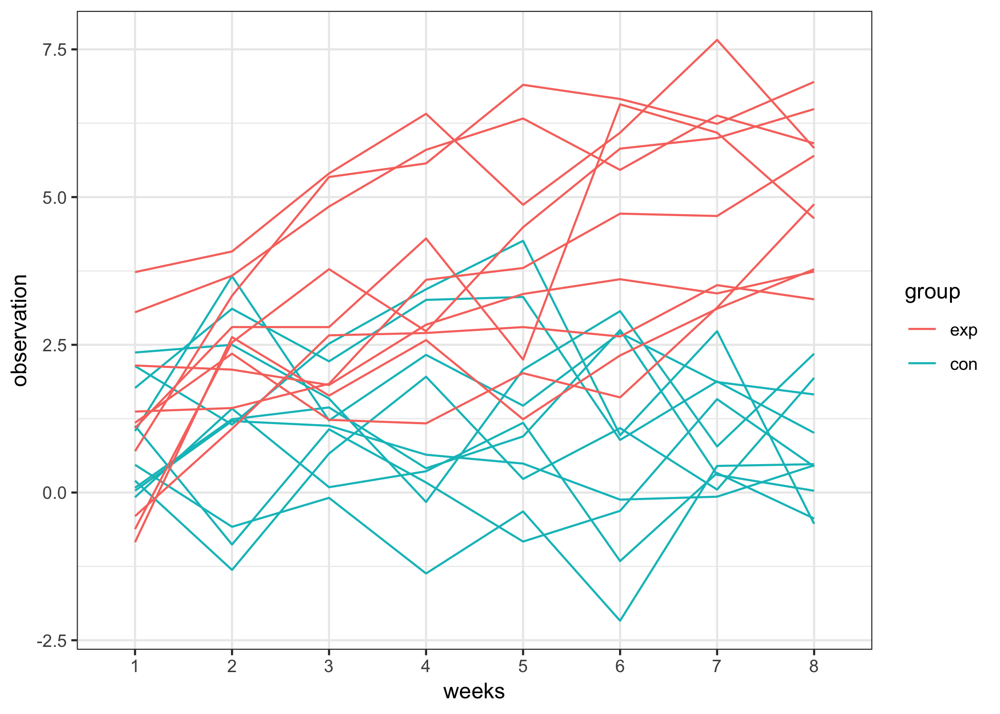
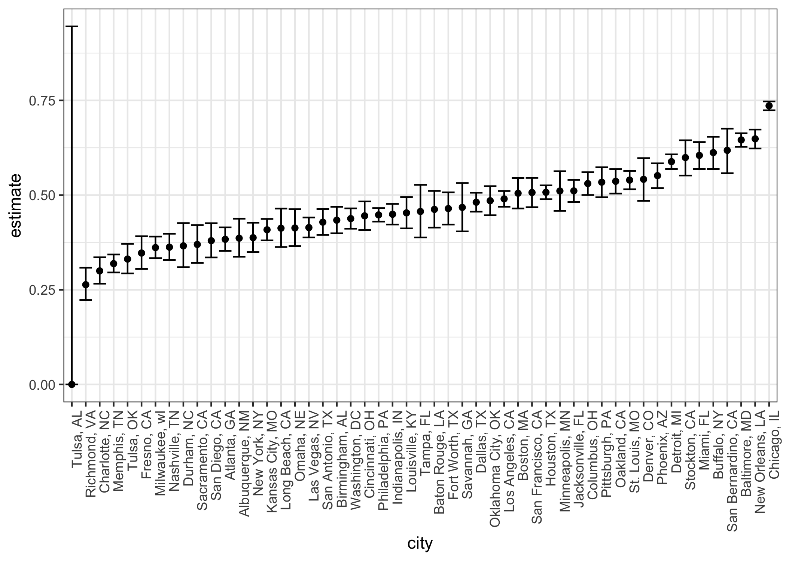

p8105\_hw5\_gw2383
================
Guojing Wu
2018/11/3

-   [Problem 1](#problem-1)
    -   [Create a tidy dataframe containing data from all participants](#create-a-tidy-dataframe-containing-data-from-all-participants)
    -   [a spaghetti plot showing observations on each subject over time](#a-spaghetti-plot-showing-observations-on-each-subject-over-time)
-   [Problem 2](#problem-2)
    -   [Describe the raw data](#describe-the-raw-data)
    -   [For the city of Baltimore, MD, use the `prop.test` function to estimate the proportion of homicides that are unsolved](#for-the-city-of-baltimore-md-use-the-prop.test-function-to-estimate-the-proportion-of-homicides-that-are-unsolved)
    -   [run `prop.test` for each of the cities](#run-prop.test-for-each-of-the-cities)

Problem 1
---------

### Create a tidy dataframe containing data from all participants

``` r
exp_df = 
  tibble(file_name = list.files("./data/problem1/", pattern = "*")) %>% 
  mutate(data = map(.x = str_c("./data/problem1/", file_name, sep=""), ~ read.csv(.x))) %>% # read data
  separate(file_name, into = c("filename", "postfix"), sep = "\\.") %>% 
  select(-postfix) %>% # remove postfix
  separate(filename, into = c("group", "id"), sep = "_", remove = F) %>% 
  unnest() %>% 
  gather(key = weeks, value = observation, week_1:week_8) %>% # gathering, tidy the data
  separate(weeks, into = c("prefix", "weeks"), sep = "_") %>% 
  select(-prefix) %>% # remove prefix
  mutate(
    filename = factor(filename), 
    group = factor(group, levels = c("exp", "con")), 
    id = factor(id), 
    weeks = factor(weeks)
  ) # transfer to factor

exp_df
```

    ## # A tibble: 160 x 5
    ##    filename group id    weeks observation
    ##    <fct>    <fct> <fct> <fct>       <dbl>
    ##  1 con_01   con   01    1            0.2 
    ##  2 con_02   con   02    1            1.13
    ##  3 con_03   con   03    1            1.77
    ##  4 con_04   con   04    1            1.04
    ##  5 con_05   con   05    1            0.47
    ##  6 con_06   con   06    1            2.37
    ##  7 con_07   con   07    1            0.03
    ##  8 con_08   con   08    1           -0.08
    ##  9 con_09   con   09    1            0.08
    ## 10 con_10   con   10    1            2.14
    ## # ... with 150 more rows

### a spaghetti plot showing observations on each subject over time

``` r
exp_df %>% 
  ggplot(aes(x = weeks, y = observation, group = filename, col = group)) +
  geom_line()
```



In this plot we can see the observations in `exp` group are higher than observations in `con` group in general (p.value = 2.665665210^{-18}).

Problem 2
---------

### Describe the raw data

``` r
homi_df = 
  read.csv("./data/problem2/homicide-data.csv") %>% 
  janitor::clean_names() %>% 
  mutate(city_state = paste(city, state, sep = ", "))
```

So in this dataset we have 52179 observations, and 13 variables include: uid, reported\_date, victim\_last, victim\_first, victim\_race, victim\_age, victim\_sex, city, state, lat, lon, disposition, city\_state

The total number of homicides and the number of unsolved homicides within cities are listed below:

``` r
homi_stat = 
  homi_df %>% 
  group_by(city_state) %>% 
  summarise(
    unsolved = sum(disposition %in% c("Closed without arrest", "Open/No arrest")), 
    total_number = n()
    )

knitr::kable(homi_stat)
```

| city\_state        |  unsolved|  total\_number|
|:-------------------|---------:|--------------:|
| Albuquerque, NM    |       146|            378|
| Atlanta, GA        |       373|            973|
| Baltimore, MD      |      1825|           2827|
| Baton Rouge, LA    |       196|            424|
| Birmingham, AL     |       347|            800|
| Boston, MA         |       310|            614|
| Buffalo, NY        |       319|            521|
| Charlotte, NC      |       206|            687|
| Chicago, IL        |      4073|           5535|
| Cincinnati, OH     |       309|            694|
| Columbus, OH       |       575|           1084|
| Dallas, TX         |       754|           1567|
| Denver, CO         |       169|            312|
| Detroit, MI        |      1482|           2519|
| Durham, NC         |       101|            276|
| Fort Worth, TX     |       255|            549|
| Fresno, CA         |       169|            487|
| Houston, TX        |      1493|           2942|
| Indianapolis, IN   |       594|           1322|
| Jacksonville, FL   |       597|           1168|
| Kansas City, MO    |       486|           1190|
| Las Vegas, NV      |       572|           1381|
| Long Beach, CA     |       156|            378|
| Los Angeles, CA    |      1106|           2257|
| Louisville, KY     |       261|            576|
| Memphis, TN        |       483|           1514|
| Miami, FL          |       450|            744|
| Milwaukee, wI      |       403|           1115|
| Minneapolis, MN    |       187|            366|
| Nashville, TN      |       278|            767|
| New Orleans, LA    |       930|           1434|
| New York, NY       |       243|            627|
| Oakland, CA        |       508|            947|
| Oklahoma City, OK  |       326|            672|
| Omaha, NE          |       169|            409|
| Philadelphia, PA   |      1360|           3037|
| Phoenix, AZ        |       504|            914|
| Pittsburgh, PA     |       337|            631|
| Richmond, VA       |       113|            429|
| Sacramento, CA     |       139|            376|
| San Antonio, TX    |       357|            833|
| San Bernardino, CA |       170|            275|
| San Diego, CA      |       175|            461|
| San Francisco, CA  |       336|            663|
| Savannah, GA       |       115|            246|
| St. Louis, MO      |       905|           1677|
| Stockton, CA       |       266|            444|
| Tampa, FL          |        95|            208|
| Tulsa, AL          |         0|              1|
| Tulsa, OK          |       193|            583|
| Washington, DC     |       589|           1345|

We noticed there is one row really strange:

| city\_state |  unsolved|  total\_number|
|:------------|---------:|--------------:|
| Tulsa, AL   |         0|              1|

But there doesn't seem to have a good explanation so we'll just leave it there.

### For the city of Baltimore, MD, use the `prop.test` function to estimate the proportion of homicides that are unsolved

``` r
# a function that doing the prop.test for homi_stat
city_pt = function(df) {
  prop.test(x = df$unsolved, n = df$total_number) %>% 
    broom::tidy()
}

output = 
  homi_stat %>% 
  filter(city_state == "Baltimore, MD") %>% 
  city_pt()

output %>% 
  select(estimate, conf.low, conf.high) %>% 
  knitr::kable()
```

|   estimate|   conf.low|  conf.high|
|----------:|----------:|----------:|
|  0.6455607|  0.6275625|  0.6631599|

### run `prop.test` for each of the cities

``` r
output_all = 
  homi_stat %>% 
  nest(unsolved, total_number) %>% 
  mutate(prop_test = map(.x = data, ~city_pt(.x))) %>% 
  unnest() %>% 
  select(city_state, estimate, conf.low, conf.high)

head(output_all,10)
```

    ## # A tibble: 10 x 4
    ##    city_state      estimate conf.low conf.high
    ##    <chr>              <dbl>    <dbl>     <dbl>
    ##  1 Albuquerque, NM    0.386    0.337     0.438
    ##  2 Atlanta, GA        0.383    0.353     0.415
    ##  3 Baltimore, MD      0.646    0.628     0.663
    ##  4 Baton Rouge, LA    0.462    0.414     0.511
    ##  5 Birmingham, AL     0.434    0.399     0.469
    ##  6 Boston, MA         0.505    0.465     0.545
    ##  7 Buffalo, NY        0.612    0.569     0.654
    ##  8 Charlotte, NC      0.300    0.266     0.336
    ##  9 Chicago, IL        0.736    0.724     0.747
    ## 10 Cincinnati, OH     0.445    0.408     0.483

Create a plot that shows the estimates and CIs for each city

``` r
output_all %>% 
  ggplot(aes(x = reorder(city_state, estimate), y = estimate)) +
  geom_point() +
  geom_errorbar(aes(ymin = conf.low, ymax = conf.high)) +
  labs(x = "city") +
  theme(axis.text.x = element_text(angle = 90, hjust = 1))
```


